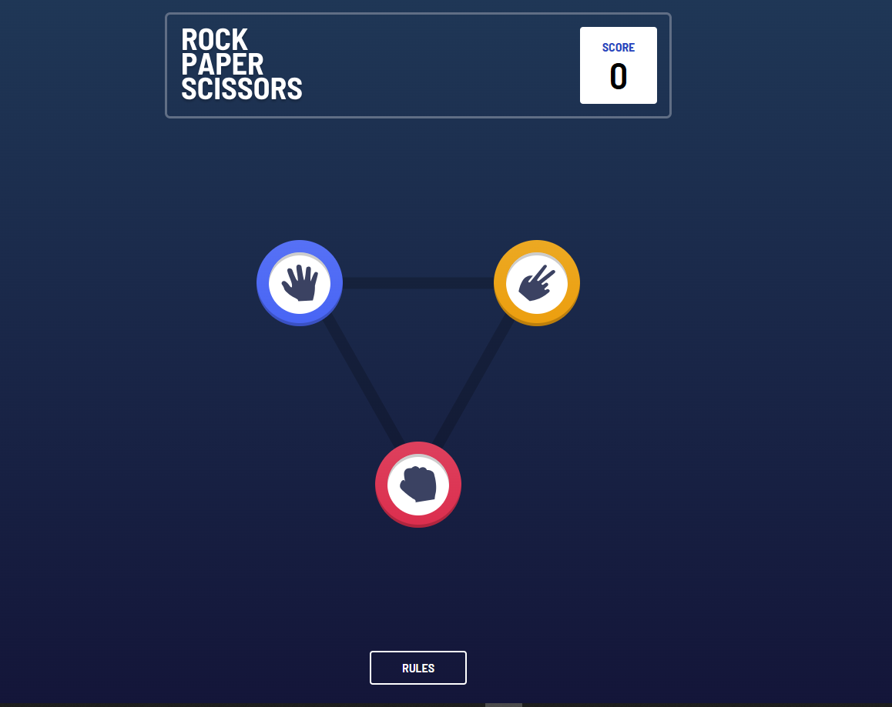

# 🪨📄✂️ Rock Paper Scissors Game

A simple and fun Rock Paper Scissors game built with modern web technologies!

👉[Live Preview](https://rock-paper-scissors-weld-three.vercel.app/)



## 🛠 Tech Stack

- ⚛️ **React + Vite** — Fast development powered by modern tooling.
- 🐻 **Zustand** — Lightweight state management made easy.
- 💨 **Tailwind CSS** — Utility-first CSS for rapid UI styling.
- 🎞️ **Framer Motion** — Smooth animations and transitions.
- 🎨 **Custom UI** — Minimal yet interactive, inspired by the classic game.

## 🚀 How to Run It

1. Clone the repo:
   ```bash
   git clone https://github.com/your-username/rock-paper-scissors.git
   cd rock-paper-scissors-game
   ```
